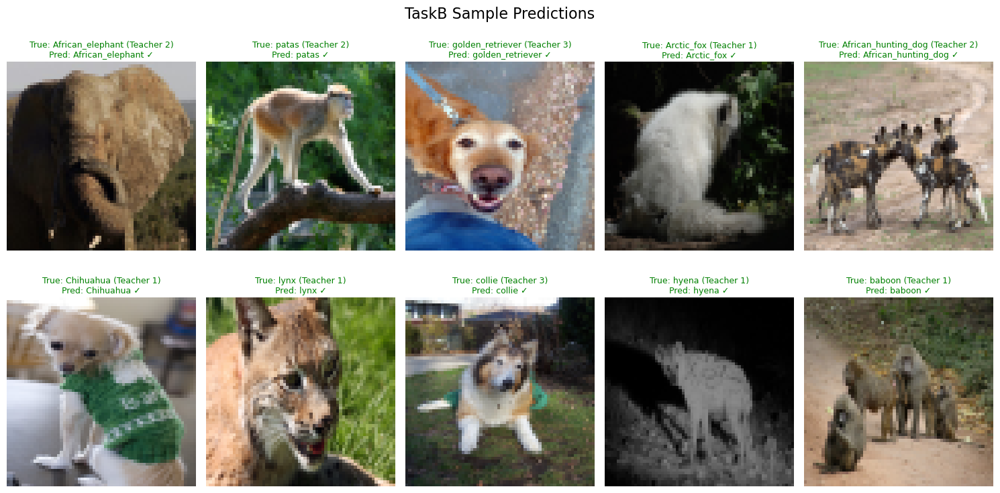

# Knowledge Distillation Project

This project implements knowledge distillation from multiple teacher models to a single student model across different tasks.

## Clone the Project

``` bash
# Clone the project
git clone git@github.com:Djanghao/cas771-knowledge-distillation.git

# Change the directory to the root
cd cas771-knowledge-distillation
```

## Download Required Resources

Before running the evaluation, download the model and data files:

```bash
# Download best models
gdown --fuzzy https://drive.google.com/file/d/1H9VcBqfV3JmZFygA7erUPydAU5XAxSh-

# Download data
gdown --fuzzy https://drive.google.com/file/d/12KVxl9n577vwoZ1WPn6U70jD37_UA0y-


# Extract downloaded files
for file in *.zip; do unzip "$file"; done && find . -type d -name "__MACOSX" -exec rm -rf {} \; 2>/dev/null
```


## Evaluation

To run all evaluation scripts at once, use:

```bash
python evaluation.py
```

This will automatically execute both `evaluation_taska.py` and `evaluation_taskb.py` in sequence and provide a summary of the results.

### Sample Predictions

Below is a sample of model predictions from our evaluation:




## Knowledge Distillation Training Parameters Guide

This document explains the key parameters for knowledge distillation from multiple teacher models to a student model, focusing on when and how to adjust them for optimal results.

## Basic Usage Examples

```bash
# Train with higher learning rate and different temperature
python train.py --lr 0.005 --temperature 3.0 --alpha 0.5

# Train with different student model architecture
python train.py --student_model MobileNetV3 --lr 0.001 --alpha 0.3

# Complete example with many parameters
python train.py --task B --batch_size 64 --num_epochs 150 --lr 0.001 --temperature 4.0 --alpha 0.6 --scheduler_step 20 --scheduler_gamma 0.7 --student_model ResNet18
```

## All Parameters Explained

### Task Selection
- `--task` (default: 'B')
  - Specifies which task to run ('A' or 'B')
  - Each task has different datasets and teacher models
  - No need to change unless working with TaskA data

### Learning Parameters

- `--lr` (default: 0.001)
  - Learning rate controls how quickly the model parameters are updated
  - **When to increase**: If training is progressing too slowly or stuck in local minima
  - **When to decrease**: If training is unstable or validation accuracy fluctuates wildly
  - **Typical range**: 0.0001 - 0.01

- `--batch_size` (default: 32)
  - Number of samples processed before model update
  - **When to increase**: With more GPU memory, to speed up training
  - **When to decrease**: If encountering out-of-memory errors
  - **Typical range**: 16 - 128, depending on GPU memory

- `--num_epochs` (default: 100)
  - Total number of passes through the entire dataset
  - **When to increase**: If model hasn't converged after initial epochs
  - **When to decrease**: For quick experiments or if early convergence is observed
  - **Typical range**: 50 - 200

- `--weight_decay` (default: 0.0005)
  - L2 regularization parameter to prevent overfitting
  - **When to increase**: If model is overfitting (high training accuracy, low validation accuracy)
  - **When to decrease**: If model is underfitting (low training accuracy)
  - **Typical range**: 0.0001 - 0.001

### Knowledge Distillation Specific Parameters

- `--temperature` (default: 2.0)
  - Controls how "soft" the teacher probability distributions become
  - Higher values produce smoother probability distributions
  - **When to increase**: To emphasize relationships between different classes
  - **When to decrease**: To make teacher outputs more peaked/confident
  - **Typical range**: 1.0 - 10.0

- `--alpha` (default: 0.1)
  - Balances between hard targets (ground truth) and soft targets (teacher outputs)
  - alpha=0 means only hard targets, alpha=1 means only soft targets
  - **When to increase**: To rely more on teacher knowledge
  - **When to decrease**: If teacher models may have inaccuracies
  - **Typical range**: 0.1 - 0.7

### Learning Rate Scheduler Parameters

- `--scheduler_step` (default: 30)
  - Number of epochs between learning rate adjustments
  - **When to increase**: For longer, more gradual training
  - **When to decrease**: To decay learning rate more frequently
  - **Typical range**: 10 - 50

- `--scheduler_gamma` (default: 0.5)
  - Factor by which learning rate is reduced at each step
  - **When to increase**: For slower learning rate decay
  - **When to decrease**: For more aggressive learning rate decay
  - **Typical range**: 0.1 - 0.9

### Model and Runtime Parameters

- `--student_model` (default: 'EfficientNet')
  - Which model architecture to use as the student
  - Options: 'MobileNetV3', 'EfficientNet', 'ResNet18'
  - **Selection guide**:
    - MobileNetV3: Fastest, smallest, but potentially lower accuracy
    - EfficientNet: Good balance of size and accuracy
    - ResNet18: Larger model with potentially higher accuracy

- `--seed` (default: 42)
  - Random seed for reproducibility
  - Change only when you want different randomization

- `--run` (default: '')
  - Optional suffix to append to the log directory name
  - Use for organizing different experiments

## Parameter Combinations for Different Scenarios

### For faster training (but potentially lower accuracy)
```bash
python train.py --lr 0.005 --temperature 2.0 --alpha 0.3 --num_epochs 50 --student_model MobileNetV3
```

### For higher accuracy (but slower training)
```bash
python train.py --lr 0.001 --temperature 4.0 --alpha 0.5 --batch_size 64 --num_epochs 200 --student_model ResNet18
```

### For balanced approach
```bash
python train.py --lr 0.002 --temperature 3.0 --alpha 0.4 --batch_size 32 --num_epochs 100 --student_model EfficientNet
```

### For overfitting prevention
```bash
python train.py --lr 0.001 --weight_decay 0.001 --alpha 0.6 --temperature 3.0
